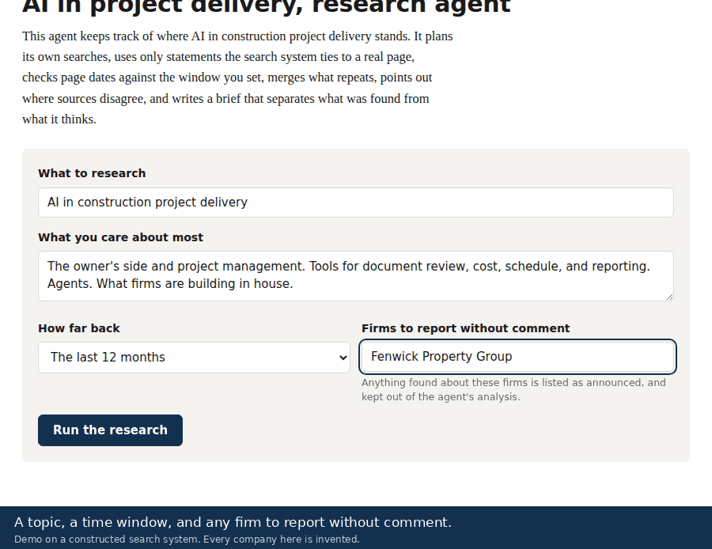
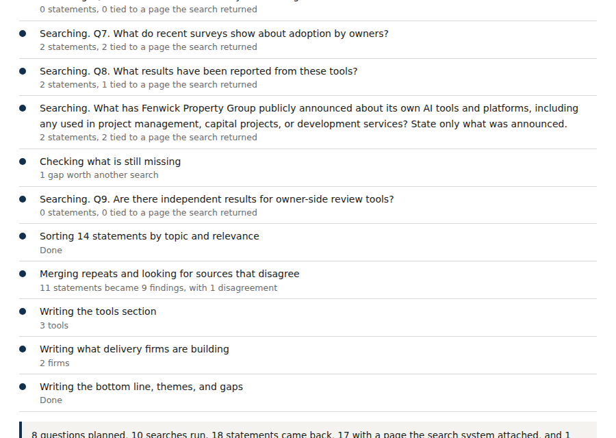
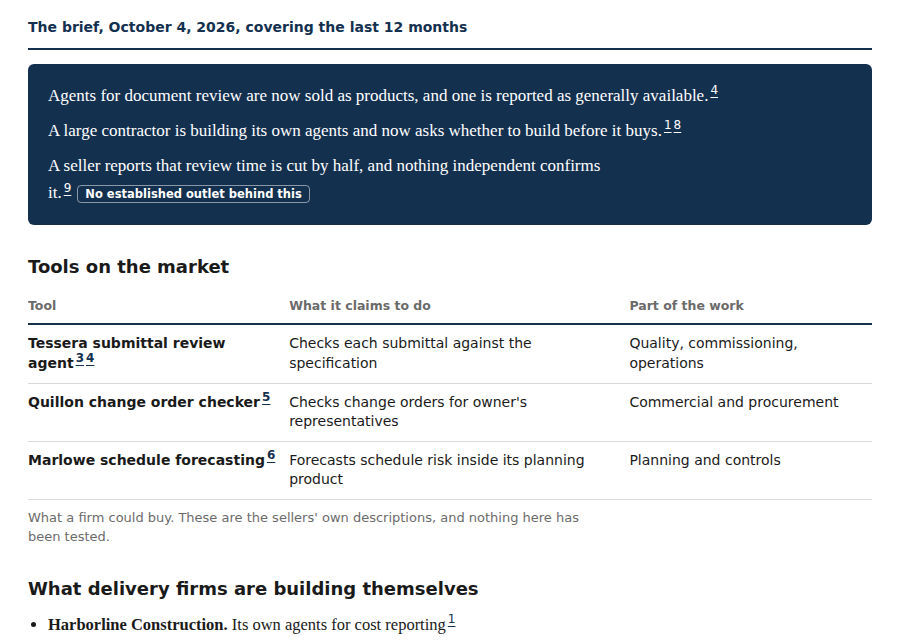
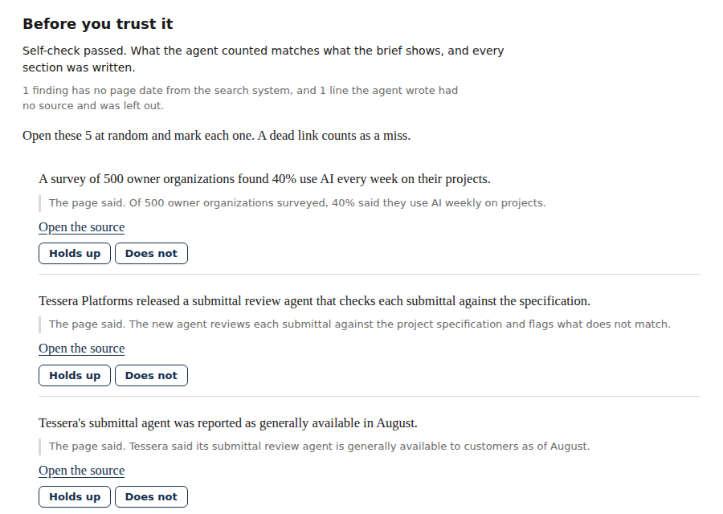

# AI in project delivery, research agent

An agent that keeps track of where AI in construction project delivery stands, and shows its work.

Give it a topic and a time window. It plans its own searches, keeps only statements the search system ties to a real page, checks each page's age against the window, merges what repeats, points out where sources disagree, and writes a brief that separates what was found from what it thinks.

The walkthrough above is the real agent running against a constructed search system. Every company in it is invented, the same way my prototypes were tested on documents I constructed. In live use it searches the open web.

## The problem

This field changes every month. A platform ships agents, a contractor announces an in-house team, a survey claims adoption has doubled. Anyone responsible for AI on a project team has to know what is real.

Two things make that hard. Most of what is written comes from sellers describing their own products. And a general AI tool will answer confidently and cite a page that does not say what it claims.

So the question was never whether an agent could write a research brief. It was whether one could write a brief a person can check.

## The approach

The same split as my document review prototypes. AI does the reading and the judgment. Code does everything that can be verified. A person makes the call.

| Step | What happens | Who does it |
|---|---|---|
| Plan | Eight questions across tools, what firms are building, what they are saying, and the evidence | AI |
| Search | Runs each question and writes short factual statements | AI |
| Attach sources | Each statement keeps only the page, the passage, and the page age that the search system itself attached. The agent never types a link | Code |
| Check the window | A page older than the window is set aside, using the system's page age | Code |
| Sort and merge | Statements are sorted by topic and relevance, and repeats are folded together | AI, checked by code |
| Label sources | Press release, the subject's own site, established outlet, research body, or unclassified, by fixed rules | Code |
| Write | The brief is written from the surviving findings only | AI |
| Self-check | What the agent counted is compared with what the brief shows, and any section that failed is reported | Code |
| Spot check | Five findings are picked at random, each shown beside the page's own words | A person |

## What the brief contains

| Section | What it holds |
|---|---|
| The bottom line | Three sentences. Any that rest on no established outlet are marked |
| Tools on the market | What a firm could buy, in the sellers' own words |
| What delivery firms are building | Owners, contractors, and consultancies building their own |
| What companies are saying | Patterns across several findings |
| Where the gaps might be | The agent's own reading, labeled as such |
| Reported without comment | Firms the reader names in advance. What they announced is listed and never reaches the analysis |
| Where sources disagree | Contradictions between sources |
| Set aside | What was found and left out, with the reason |
| Findings and their sources | Every finding with its link, source type, and page age |
| Before you trust it | The self-check result and the spot check |

## What broke and what I changed

The first version worked on the first run and was wrong in ways that took six runs to find.

| Run | What it showed | What I changed |
|---|---|---|
| 1 | Repeats, no sense of source quality, no bottom line | Merging, source labels, a bottom line |
| 2 | Vendor marketing stated as fact. The time window ignored | A flag on seller-only statements. The window enforced |
| 3 | The same publisher labeled two different ways | One label per site |
| 4 | Disagreements between sources silently dropped | Kept and shown |
| 5 | Two whole sections missing, and my own self-check said it passed | A retry, a visible failure, and a self-check that looks for missing sections |
| 6 | Two of five findings did not hold up when I opened the page | Stopped patching. Measured first |

After the sixth run I stopped fixing one thing at a time. Each patch had been solving the last problem and creating the next.

I built a small probe to see what the search system actually returns. It showed that the system attaches the exact page and passage behind each statement, and reports each page's age. The agent had been throwing that away and typing its own links.

So the final version was built once, from a written change list approved before any code. Links, passages, and dates now come from the system. Source types come from fixed rules, not from the agent's opinion.

## How it is tested

| Test | Result |
|---|---|
| Automated checks against a simulated search system, one or more for each known failure | 66 of 66 pass |
| Deliberate breaks. Ten safeguards removed one at a time, to prove the test notices | All ten caught |
| Acceptance. Two live runs, each needing a passing self-check and at least four of five findings holding up | Both passed, five of five |

The acceptance bar was set before the final build, not after. The two acceptance runs were live, on the open web. The walkthrough on this page is a third run, on constructed data, made so the demo names no real company.

## Screenshots

These are from the same constructed run as the walkthrough.

**The agent at work.** Each step appears as it happens, with a count of what came back.

**The brief.** The third sentence rests on a seller's own claim, so it is marked.

**Before you trust it.** The self-check, then findings shown beside the page's own words.

## What this is and is not

It is a working agent that I use. It runs inside Claude and uses its web search. It is not a standalone product.

I designed it, set the rules and the acceptance bar, and tested it. An AI assistant wrote the code under my direction, the same way I built the prototypes.

The source code is not in this repo. I am glad to walk through it live.

A page can move or change after it is indexed, and no check inside the tool can catch that. That is why the spot check exists.

The gaps it suggests are its own reading and change from run to run. They are questions, not findings.

A brief is a list of leads to open, not a verified report.

I built this on my own time.

## Related

- [Where AI belongs in construction project delivery](https://github.com/prentice-builds/ai-in-project-delivery). My report on where AI fits in a project manager's work.
- [Construction document review prototypes](https://github.com/prentice-builds/construction-review-prototypes). Three reviews built the same way. AI interprets, code checks, and the project manager decides.

## Contact

Ryan Prentice, Senior Project Manager
rprentice99@gmail.com
[LinkedIn](https://www.linkedin.com/in/ryan-prentice-45666b57/)
